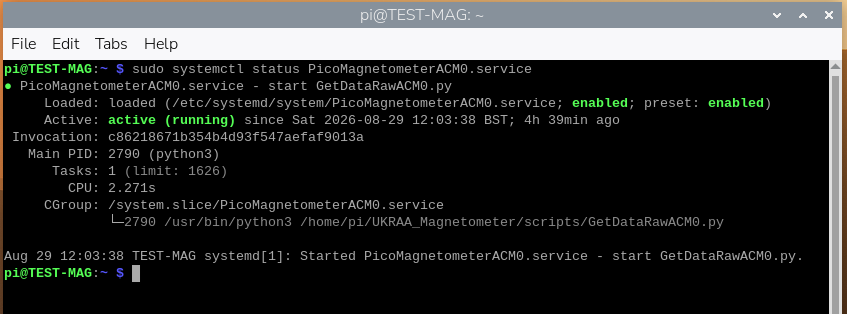
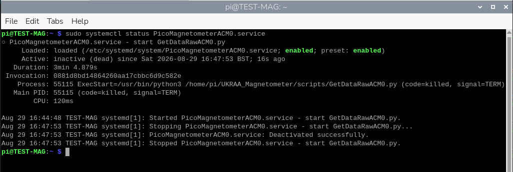
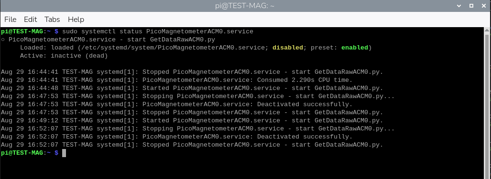

<div align=center>

</div>


# Python code for the UKRAA PicoMagnetometer
[](/LICENSE)
[](https://www.python.org/)
[](https://www.gnu.org/software/bash/)
[](https://www.gnuplot.info/)
[](https://www.raspberrypi.org/)
[](https://www.raspberrypi.com/)

Set of Python, gnuplot and shell scripts to run on a RPi4/5 to record, process and present data from the UKRAA PicoMagnetometer.

This software was written to suit a specific set-up; feel free to use as you see fit.

Instructions for initial setting up of a Raspberry Pi4/5 are included in the **docs** folder

---

&nbsp;
<!-- =============================================================================== --> 
## Contents

- [Using the code](#using-the-code) 
- [Where is my PicoMagnetometer](#where-is-my-Picomagnetometer)
- [Getting the software onto your RPi](#getting-the-software-onto-your-RPi)
- [Installing the software onto your RPi](#installing-the-software-onto-your-RPi)
- [What does the code do](#what-does-the-code-do)
- [Check PicoMagnetometerACM0 service is running](#check-PicoMagnetometerACM0-service-is-running)
- [Optional Post install operational checks](#Optional-Post-install-operational-checks)
- [Optional Rolling alert Emails](#Optional-Rolling-alert-Emails)
- [Optional Remote FTP upload](#Optional-Remote-FTP-upload)
- [License](#license)
- [Contact us](#contact-us)

&nbsp;

---

&nbsp;
<!-- =============================================================================== --> 
## Using the code

The code assumes that your UKRAA PicoMagnetometer is the only device using USB that is connected to the RPi4/5 via supplied USB cable and that it is /dev/ttyACM0 - you can check this by using **ls /dev/ttyAC*** in a terminal window on the RPi4/5 and reviewing the response.

The code assumes username is **pi**. 

If **pi** is not the username, then you will need to change all occurances of '/home/pi' to '/home/*username*' in all the python, gnuplot and shell scripts prior to installing the software; where *username* is the username you have selected for your RPi4/5.

The code assumes one magnetometer connected to the RPi4/5 USB and that it will be connected via **/dev/ttyACM0**.

If there are other devices connected to the RPi and your magnetometer is not **/dev/ttyACM0**, then you will need to change **/dev/ttyACM0** to **/dev/*ttyACMx*** in the **GetDataRaw.py** python script, where *ttyACMx* is the tty address of you connected magnetometer.

**GetDataRawACM0.py** is run as a service.

Other scripts (Python and gnuplot) are run from **cron** using shell scripts.

[Back to Contents...](#contents)

&nbsp;

---

&nbsp;<!-- =============================================================================== --> 
### Where is my PicoMagnetometer

Plug your PicoMagnetometer into any of the RPi USB ports - I normally use one of the blue ports (USB3).

1. Open a terminal window and type the following command and press enter
```
ls /dev/tty*
```


&nbsp;

2. You are looking for **/dev/ttyACM0** - this is on the right hand side of the screen shot above.

&nbsp;

3. This is the USB address for your attached PicoMagnetometer - if you have more than one magnetometer attached you may see **/dev/ttyACM1** etc.

&nbsp;

4. If you do not see **/dev/ttyACM0**, then unplug and plug the PicoMagnetometer back in and try again.

&nbsp;

5. As long as you see **/dev/ttyACM0** then you do not have to make any changes to the python scripts, because they are looking for **ACM0**.

[Back to Contents...](#contents)

&nbsp;

---

&nbsp;

<!-- =============================================================================== --> 
## Getting the software onto your RPi

1. Log into your Raspberry Pi4/5 using VNC.

&nbsp;

2. Open a terminal window, type the following command and press enter
```
git clone https://github.com/UKradioastro/UKRAA_Magnetometer.git
```


This will download all of the code to the directory **UKRAA_Magnetometer** inside **/home/pi**

[Back to Contents...](#contents)

&nbsp;

---

&nbsp;
<!-- =============================================================================== --> 
## Installing the software onto your RPi


1. Open a terminal window and type the following command and press enter
```
cd ~/UKRAA_Magnetometer/install
```


This will take you to the **install** directory inside **/home/pi/UKRAA_Magnetometer**


2. Type the following command and press enter
```
chmod +x *.sh
```


This will make the **install.sh** script executable.


3. Type the following command and press enter
```
sudo bash install.sh
```


This will run the install script.

There may be occasions during the running of the install script that require you to make a keyboard entry.

When asked **Do you want to continue? [Y/n]** - type **Y** or **y** and press **enter** 

That's it!

The code is now set up to run automatically; it will record the data from the PicoMagnetometer, process the data, plot the data and post the plots to your intranet web page.

There are other functions that are customisable by the user, such as **email alerts** and **FTP service** to users’ external website, that are covered in the **User Manual**.

**Optional**: run an install-time heartbeat smoke check (disabled by default):

```
sudo MAGNETOMETER_INSTALL_SMOKE_HEARTBEAT=1 bash install.sh
```

This runs `--test-heartbeat` once during install and prints a clear `HEARTBEAT_SMOKE_CHECK: PASS` or `HEARTBEAT_SMOKE_CHECK: FAIL` summary.


[Back to Contents...](#contents)

&nbsp;

---

&nbsp;
<!-- =============================================================================== --> 
## What does the code do

The code records data from the UKRAA Magnetometer via serial over the supplied USB cable and stores the event data to the raw data folder.

The raw data will be processed daily, via CRON, to get magnetic field values per minute in the X (N->S), Y (E->W) and Z (U->D) directions from your previous day’s data.  The maximum hourly variation of the magnetic field values in the X (N->S) and Y (E->W) directions will also be produced.

A number of plots will be created:
* X, Y and Z (North/South, East/West and up/down)
* Maximum hourly variation in X and Y directions
* H, D and Z (Local horizontal plane, declination angle and up/down)
* B and I (Total strength Earths magnetic field and angle of Earths magnetic field)

**Note**: H, D & Z plots together with B & I plots are disabled by default, these plots can be reactivated by changing the configuration filesfiles - see **User Manual: Additional graphs** for more details.

The raw data will also be processed on a continuous 5 minute basis, again via CRON, to generate a rolling 24 hour plot of X, Y and Z magnetic fields and % change of magnetic field for combined X and Y directions.  The latter used to predict the potential of visible Aurora activity.  Should a threshold level be reached for % change of magnetic field, then the user has the option to receive an email alert - see **User Manual: Rolling alert emails** for more details.

A simple web server and web page is set up on your RPi4/5, so that you can view your magnetometer's results on your desktop PC and/or smart phone when connected to your home network.

To access the PicoMagnetometer webpage on your desktop PC or your smart phone…

1.	Open your preferred web application (Safari, Chrome, Firefox, etc.).

2.	In the search bar type the following and press enter
```
http://TEST-MAG.local
```


This will take you to the web page for your magnetometer, displaying both the rolling 24 hour plots and yesterday’s plots.

NOTE: if you have a different **hostname** for your RPi, change the search bar entry to…

**http://_hostname_.local**

Where *hostname* is the hostname for your RPi setup.

Code is also supplied that will enable the user to upload, via FTP, to their host website, should they have one - see **User Manual: FTP service** for more details.

[Back to Contents...](#contents)

&nbsp;

---

&nbsp;
<!-- =============================================================================== --> 
## Check PicoMagnetometerACM0 service is running

1. To check the **status** of your service, type the following command and press enter.
```
sudo systemctl status PicoMagnetometerACM0.service
```

Two **GREEN enabled** and a **GREEN active (running)** indicates service running correctly.



&nbsp;

2. To **start** your service, type the following command and press enter.
```
sudo systemctl start PicoMagnetometerACM0.service
```

&nbsp;

3. To **stop** your service, type the following command and press enter.
```
sudo systemctl stop PicoMagnetometerACM0.service
```

An enabled service that is stopped will only have two **GREEN enables** and an **inactive(dead)**



If this is the case you will need to:
- Start the service

&nbsp;

4. To **enable** your service, type the following command and press enter.
```
sudo systemctl enable PicoMagnetometerACM0.service
```

&nbsp;

5. To **disable** your service, type the following command and press enter.
```
sudo systemctl disable PicoMagnetometerACM0.service
```

A disabled service will have a **YELLOW disabled**, a **GREEN enabled** and an **inactive (dead)**



If this is the case you will need to:
- Enable the service
- Start the service


[Back to Contents...](#contents)

&nbsp;

---

&nbsp;
<!-- =============================================================================== -->
## Optional Post install operational checks

### runPostUpdateChecksACM0.sh

After installing/updating scripts on your RPi, you can run:

```
sudo bash /home/pi/UKRAA_Magnetometer/scripts/runPostUpdateChecksACM0.sh
```

This executes:
- optional daily publish logic checks
- optional HDZ/BI web visibility checks

### checkDailyPublishHealthACM0.sh
For daily runtime monitoring, a health marker is written by:

```
sudo bash /home/pi/UKRAA_Magnetometer/scripts/checkDailyPublishHealthACM0.sh
```

Marker output file:

```
/home/pi/UKRAA_Magnetometer/data/status/daily-health.txt
```

The marker reports one of three states:

- `PASS` - yesterday was processed and all expected plots are published.
- `PENDING` - no raw data was recorded for yesterday, so there was nothing to
  process. Expected on the first day after a fresh install, or if the
  acquisition service was stopped all day. Exit code 0.
- `FAIL` - raw data existed but the processed file or one or more published
  plots are missing. This is a real fault. Exit code 1.

### showDashboardSummaryACM0.sh
One-line dashboard summary on demand:

```
sudo bash /home/pi/UKRAA_Magnetometer/scripts/showDashboardSummaryACM0.sh
```

If scheduled in cron, summary snapshots can be collected in:

```
/home/pi/UKRAA_Magnetometer/logfiles/dashboard-summary.log
```

[Back to Contents...](#contents)

&nbsp;

---

&nbsp;
<!-- =============================================================================== --> 
## Optional HDZ and/or BI plots

Within the **/home/pi/UKRAA_Magnetometer/config** folder there is a file named **plot.ini**.

By default the option of producing HDZ and/or BI plots is turned off (**false**), and the plots do not appear as an option from the intranet webpage.

Should the user wish to have access to HDZ and/or BI rolling plots and yesterday’s plots for these options then change the following in the plots.ini file:

- For HDZ plots change line 13
    - From **plot_hdz = false**
    - To **plot_hdz = true**

- For BI plots change line 19
    - From **plot_bi = false**
    - To **plot_bi = true**

These plots will automatically be added to the intranet webpage if selected; with the rolling plot being present after 5 minutes and yesterdays plot being present after 09:30 the next day.

[Back to Contents...](#contents)

&nbsp;

---

&nbsp;
<!-- =============================================================================== --> 
## Optional Rolling alert Emails

Within the **/home/pi/UKRAA_Magnetometer/config** folder there is a file named **alert.ini**.

By default the option of producing rolling email alerts is turned off (**false**).

Should the user wish to receive rolling email alerts from their PicoMagnetometer follow the instructions below;

Rolling alert evaluation supports user defined activity thresholds:

* **Yellow** at **50 nT**
* **Amber** at **100 nT**
* **Red** at **200 nT**


The user can define their own alert values by modifying lines 18, 19 and 20 of **alert.ini**.

The alert evaluator runs as part of `processRollingData.sh` and only sends email on threshold transitions to levels you choose.

The same threshold values are also used by:

* Daily hourly Activity plot (`PlotDataActivityACM0.gp`)
* Rolling Activity plot (`PlotRollingActivityACM0.gp`)

### Configure via `.ini` file (recommended)

1. Copy the example file:
	`install/alerts.ini.example`

2. Place it on the Pi as:
	`/home/pi/UKRAA_Magnetometer/config/alerts.ini`

3. Edit the values for your SMTP service and recipients.  **DO THIS BEFORE CHANGING THE STATE OF email_enabled**

4. Set activity thresholds in the same file under `[alerts]`:

```
[alerts]
yellow_threshold_nt = 50
amber_threshold_nt = 100
red_threshold_nt = 200
```

### Enable or disable alert emails

Email sending is off by default so a fresh install does not log SMTP failures every 5 minutes.

In `alerts.ini`:

```
[alerts]
email_enabled = true
```

Notes:

* When `email_enabled = false`, thresholds, alert levels, plots and the web status page all still work; only email sending is skipped.
* Suppression is logged once per level transition, not on every run.
* The daily heartbeat email is also skipped while `email_enabled = false`.
* The manual test scripts (`testAlertEmailACM0.sh`, `testHeartbeatEmailACM0.sh`) still send, so you can verify SMTP before enabling.
* Environment variable override: `MAGNETOMETER_EMAIL_ENABLED`

By default, `EvaluateAlertsACM0.py` reads:
`/home/pi/UKRAA_Magnetometer/config/alerts.ini`

You can override the config path with:
`MAGNETOMETER_ALERTS_INI_PATH=/path/to/alerts.ini`

### Configure which levels trigger email

Set `MAGNETOMETER_EMAIL_ALERT_LEVELS` as a comma-separated list:

* `RED`
* `RED,AMBER`
* `RED,AMBER,YELLOW`

For instance:
- if you only require RED trigger alerts set **email_alert_levels = RED**
- if you require both RED and AMBER trigger alerts set **email_alert_levels = RED,AMBER**
- if you require all alerts set **email_alert_levels = RED,AMBER,YELLOW**


### Configure SMTP and recipients

You can set SMTP/email values in the `.ini` file, or by environment variables.
Environment variables take precedence if both are set.

In alerts.ini:

```
[smtp]
host = smtp.example.com
port = 587
username = your-smtp-username
password = your-smtp-password
starttls = true
ssl = false

[email]
from = magnetometer@example.com
to = you@example.com
attach_plot = false 
```

Notes:
- If `RollingActivity.png` exists, it is attached to the alert email if **attach_plot = true**

Available environment variables are:

* `MAGNETOMETER_SMTP_HOST` (required)
* `MAGNETOMETER_SMTP_PORT` (default `587`)
* `MAGNETOMETER_SMTP_USERNAME` (optional)
* `MAGNETOMETER_SMTP_PASSWORD` (optional)
* `MAGNETOMETER_SMTP_STARTTLS` (`true` by default)
* `MAGNETOMETER_SMTP_SSL` (`false` by default)
* `MAGNETOMETER_EMAIL_FROM` (required)
* `MAGNETOMETER_EMAIL_TO` (required, comma-separated for multiple recipients)
* `MAGNETOMETER_EMAIL_ATTACH_PLOT` (`true` by default)
* `MAGNETOMETER_WEB_URL` (optional, included in email body)

### Notes

* Alert state is stored in `data/alerts/alert-state.json`
* Rolling status is read from `data/status/current.json`
* If `RollingActivity.png` exists, it is attached to the alert email
* Alert evaluator config precedence is: environment variable -> `.ini` file -> built-in default

### Regenerate a chosen Activity date (quick local test mode)

You can regenerate the hourly Activity plot for any date without storing an archive copy by default:

```
/bin/bash /home/pi/UKRAA_Magnetometer/scripts/testActivityPlotACM0.sh YYYY-MM-DD
```

This updates only:

* `/home/pi/UKRAA_Magnetometer/temp/Activity.png`

To also write the dated archive file in `plots/Activity/`, add `--archive`:

```
/bin/bash /home/pi/UKRAA_Magnetometer/scripts/testActivityPlotACM0.sh YYYY-MM-DD --archive
```

### Send a one-off SMTP test email

To verify SMTP settings without waiting for a threshold transition, run:

```
/bin/bash /home/pi/UKRAA_Magnetometer/scripts/testAlertEmailACM0.sh
```

Or run the Python script directly:

```
/usr/bin/python3 /home/pi/UKRAA_Magnetometer/scripts/EvaluateAlertsACM0.py --test-email
```

The test email does not update transition state, so normal alert logic is unaffected.

### Optional daily heartbeat email

You can enable a once-per-day summary email so you know the system is alive even when no threshold transition occurs.

In `alerts.ini`:

```
[heartbeat]
enabled = true
hour_utc = 9
to =
attach_plot = false
```

Notes:

* `hour_utc` is the first UTC hour of the day when the heartbeat can send.
* Only one heartbeat attempt is made per UTC day (success or failure), to avoid retry spam every 5 minutes.
* If `RollingActivity.png` exists, it is attached to the heartbeat email if **attach_plot = true**
* If `heartbeat.to` is blank, it uses `[email] to`.

Environment variable overrides are also available:

* `MAGNETOMETER_HEARTBEAT_ENABLED`
* `MAGNETOMETER_HEARTBEAT_HOUR_UTC`
* `MAGNETOMETER_HEARTBEAT_TO`
* `MAGNETOMETER_HEARTBEAT_ATTACH_PLOT`

### Send a one-off heartbeat test email immediately

To verify heartbeat email delivery without waiting for `heartbeat.hour_utc`, run:

```
/bin/bash /home/pi/UKRAA_Magnetometer/scripts/testHeartbeatEmailACM0.sh
```

Or run the Python script directly:

```
/usr/bin/python3 /home/pi/UKRAA_Magnetometer/scripts/EvaluateAlertsACM0.py --test-heartbeat
```

This immediate heartbeat test does not update daily heartbeat schedule/state tracking.


[Back to Contents...](#contents)

&nbsp;

---

&nbsp;
<!-- =============================================================================== --> 
## Optional Remote FTP upload

Within the **/home/pi/UKRAA_Magnetometer/config** folder there is a file named **remote-upload.ini**.

By default the option of uploading plot PNG files is turned off (**false**).

Should the user wish to upload plot PNG files from their PicoMagnetometer to an externally hosted webpage follow the instructions below;

You can upload plot PNG files to an external hosting site while keeping local web publishing as the primary path.

Remote upload config file:

* `/home/pi/UKRAA_Magnetometer/config/remote-upload.ini`

Template created by installer:

* `install/remote-upload.ini.example`

Example settings:

```
[ftp]
enabled = true
site = your-uploader-fp
user = your-upload-user
password = your-upload-password
port = 21
directory = /data
timeout_seconds = 30
passive = true
create_dirs = true
upload_status_json = false
```

Behavior:

* Daily run (09:30 via `moveGraphs.sh`) uploads:
	* `Activity.png`, `X.png`, `Y.png`, `Z.png` to `/data`
* Rolling run (every 5 minutes via `processRollingData.sh`) uploads:
	* `RollingActivity.png`, `RollingXYZ.png` to `/data/rolling`
* Optional rolling status JSON upload:
	* set `upload_status_json = true`
	* uploads `data/status/current.json` to `/data/status/current.json`
	* external webpage status fallback (`status/current.json`) requires this to be true.
* Remote upload failures are non-blocking and do not stop local publishing.

Manual test commands:

```
/bin/bash /home/pi/UKRAA_Magnetometer/scripts/uploadRemoteACM0.sh daily
/bin/bash /home/pi/UKRAA_Magnetometer/scripts/uploadRemoteACM0.sh rolling
```

Combined test helper:

```
/bin/bash /home/pi/UKRAA_Magnetometer/scripts/testRemoteUploadACM0.sh
```

[Back to Contents...](#contents)

&nbsp;

---

&nbsp;

<!-- =============================================================================== --> 
### License

MIT License

Copyright (c) 2024 UKRAA

Permission is hereby granted, free of charge, to any person obtaining a copy
of this software and associated documentation files (the **Software**), to deal
in the Software without restriction, including without limitation the rights
to use, copy, modify, merge, publish, distribute, sublicense, and/or sell
copies of the Software, and to permit persons to whom the Software is
furnished to do so, subject to the following conditions:

The above copyright notice and this permission notice shall be included in all
copies or substantial portions of the Software.

THE SOFTWARE IS PROVIDED **AS IS**, WITHOUT WARRANTY OF ANY KIND, EXPRESS OR
IMPLIED, INCLUDING BUT NOT LIMITED TO THE WARRANTIES OF MERCHANTABILITY,
FITNESS FOR A PARTICULAR PURPOSE AND NONINFRINGEMENT. IN NO EVENT SHALL THE
AUTHORS OR COPYRIGHT HOLDERS BE LIABLE FOR ANY CLAIM, DAMAGES OR OTHER
LIABILITY, WHETHER IN AN ACTION OF CONTRACT, TORT OR OTHERWISE, ARISING FROM,
OUT OF OR IN CONNECTION WITH THE SOFTWARE OR THE USE OR OTHER DEALINGS IN THE
SOFTWARE.

[Back to Contents...](#contents)

&nbsp;

---

&nbsp;
<!-- =============================================================================== --> 
### Contact us

Please send an e-mail to PicoMagnetometer@ukraa.com

[Back to Contents...](#contents)

&nbsp;

---
