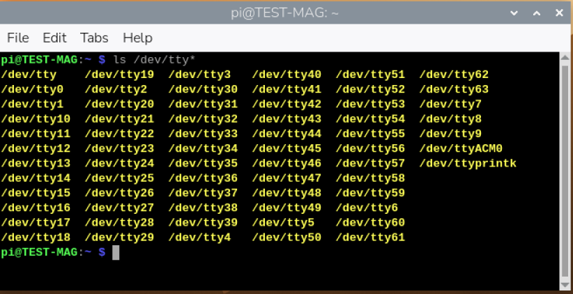
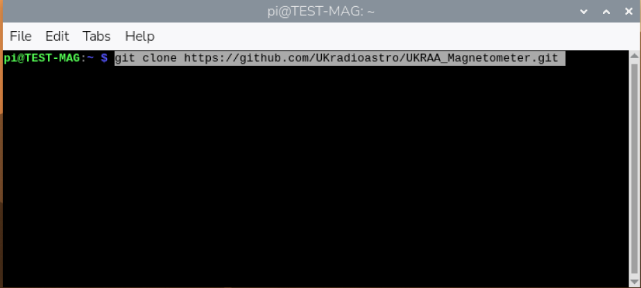
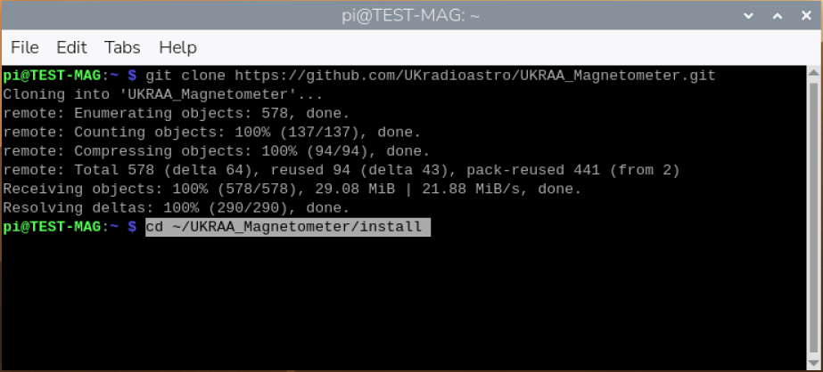
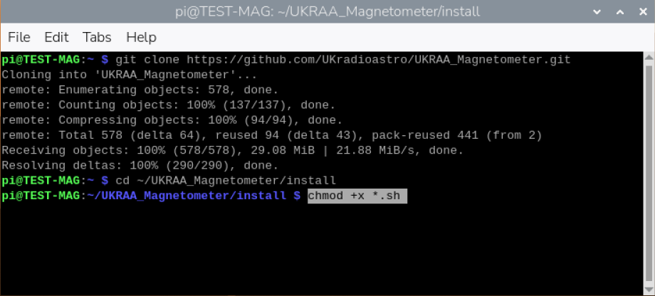
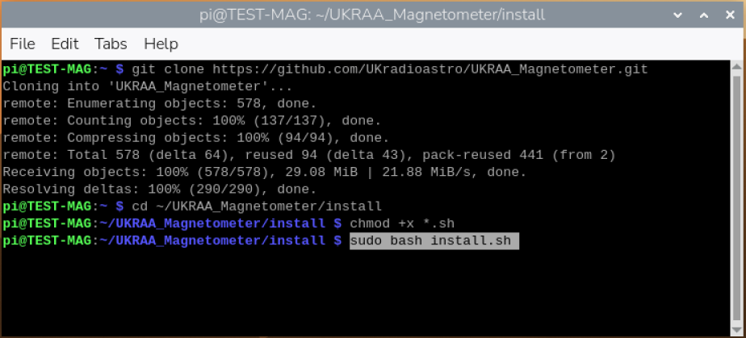

<div align=center>

</div>


# Python code for the UKRAA PicoMagnetometer
[](/LICENSE)
[](https://www.python.org/)
[](https://www.gnu.org/software/bash/)
[](https://www.gnuplot.info/)
[](https://www.raspberrypi.org/)
[](https://www.raspberrypi.com/)

Set of Python code to run on a RPi4/5 to get, process and present data from the UKRAA PicoMagnetometer

This software was written to suit a specific set-up, feel free to use as you see fit.

Instructions for setting up a Raspberry Pi4/5 are included in the **docs** folder

---

&nbsp;
<!-- =============================================================================== --> 
## Contents

- [Using the code](#using-the-code) 
- [Where is my PicoMagnetometer](#where-is-my-Picomagnetometer)
- [Getting the software onto your RPi](#getting-the-software-onto-your-RPi)
- [Installing the software onto your RPi](#installing-the-software-onto-your-RPi)
- [What does the code do](#what-does-the-code-do)
- [Check PicoMagnetometerACM0 service is running](#check-PicoMagnetometerACM0-service-is-running)
- [License](#license)
- [Contact us](#contact-us)

&nbsp;

---

&nbsp;
<!-- =============================================================================== --> 
## Using the code

The code assumes that your UKRAA PicoMagnetometer is connected to a RPi4/5 via supplied USB cable and that it is /dev/ttyACM0 - you can check this by using **ls /dev/ttyAC*** in a terminal window on the RPi4/5 and reviewing the response.

The code assumes username is **pi**. 

If **pi** is not the username, then you will need to change all occurances of '/home/pi' to '/home/*username*' in all the python, gnuplot and shell scripts prior to installing the software; where *username* is the username you have selected for your RPi4/5.

The code assumes one magnetometer connected to the RPi4/5 USB and that it will be connected via **/dev/ttyACM0**.

If there are other devices connected to the RPi and your magnetometer is not **/dev/ttyACM0**, then you will need to change **/dev/ttyACM0** to **/dev/*ttyACMx*** in the **GetDataRaw.py** python script, where *ttyACMx* is the tty address of you connected magnetometer.

**GetDataRawACM0.py** is run as a service.

Other scripts (Python, gnuplot) are run from **cron** using shell scripts.

[Back to Contents...](#contents)

&nbsp;

---

&nbsp;<!-- =============================================================================== --> 
### Where is my PicoMagnetometer

Plug your PicoMagnetometer into any of the RPi USB ports - I normally use one of the blue ports (USB3).

1. Open a terminal window and type the following command and press enter
```
ls /dev/tty*
```



&nbsp;

2. You are looking for **/dev/ttyACM0** - this is on the right hand side of the screen shot above.

&nbsp;

3. This is the USB address for your attached PicoMagnetometer - if you have more than one magnetometer attached you may see **/dev/ttyACM1** etc.

&nbsp;

4. If you do not see **/dev/ttyACM0**, then unplug and plug the PicoMagnetometer back in and try again.

&nbsp;

5. As long as you see **/dev/ttyACM0** then you do not have to make any changes to the python scripts, because they are looking for **ACM0**.

[Back to Contents...](#contents)

&nbsp;

---

&nbsp;

<!-- =============================================================================== --> 
## Getting the software onto your RPi

1. Log into your Raspberry Pi4/5 using VNC.

&nbsp;

2. Open a terminal window, type the following command and press enter
```
git clone https://github.com/UKradioastro/UKRAA_Magnetometer.git
```



This will download all of the code to the directory **UKRAA_Magnetometer** inside **/home/pi**

[Back to Contents...](#contents)

&nbsp;

---

&nbsp;
<!-- =============================================================================== --> 
## Installing the software onto your RPi


1. Open a terminal window and type the following command and press enter
```
cd ~/UKRAA_Magnetometer/install
```



This will take you to the **install** directory inside **/home/pi/UKRAA_Magnetometer**


2. Type the following command and press enter
```
chmod +x *.sh
```



This will make the **install.sh** script executable.


3. Type the following command and press enter
```
sudo bash install.sh
```



This will run the install script.

There may be occasions during the running of the install script that require you to make a keyboard entry.

When asked **Do you want to continue? [Y/n]** - type **Y** or **y** and press **enter** 

That's it!

The code is now set up to run automatically; it will get the data from the PicoMagnetometer, process the data, plot the data and post the plots to your intranet web page.

There are other functions that are customisable by the user, such as **email alerts** and **FTP service** to users’ external website, that are covered in the **User Manual**.

**Optional**: run an install-time heartbeat smoke check (disabled by default):

```
sudo MAGNETOMETER_INSTALL_SMOKE_HEARTBEAT=1 bash install.sh
```

This runs `--test-heartbeat` once during install and prints a clear `HEARTBEAT_SMOKE_CHECK: PASS` or `HEARTBEAT_SMOKE_CHECK: FAIL` summary.


[Back to Contents...](#contents)

&nbsp;

---

&nbsp;
<!-- =============================================================================== --> 
## What does the code do

The code receives the event data from the UKRAA Magnetometer via serial over the supplied USB cable and stores the event data to the raw data folder.

The raw data will be processed overnight, via CRON, to get magnetic field values per minute, in the x, y and z directions, from your previous day's data.

A number of plots will be created:
* X, Y and Z (North/South, East/West and up/down)
* H, D and Z (Local horizontal plane, declination angle and up/down)
* B and I (Total strength Earths magnetic field and angle of Earths magnetic field)

Note: H, D & Z plots together with B & I plots are disabled by default, these plots can be reactivated by changing the configuration filesfiles - see **User Manual: Additional graphs** for more details.

The raw data will also be processed on a continuous 5 minute basis, again via CRON, to produce a rolling 24 hour plot of X, Y and Z magnetic fields and % change of magnetic field for combined X and Y directions.  The latter used to predict the potential of visible Aurora activity.  Should a threshold level be reached for % change of magnetic field, then the user will receive an email alert of such - see [Rolling alert emails](#rolling-alert-emails) for more details.

A simple web server and web page is set up on your RPi4/5, so that you can view your magnetometer's results on your desktop PC and/or smart phone when connected to your home network.

To access the webpage on your desktop PC or your smart phone…

1.	Open your preferred web application (Safari, Chrome, Firefox, etc.).

2.	In the search bar type the following and press enter
```
http://rpi4-UKRAA-MAG.local
```

This will take you to the web page for your magnetometer, displaying both the rolling 24 hour plots and yesterday’s events plots.

NOTE: if you have a different **hostname** for your RPi, change the search bar entry to…

**http://_hostname_.local**

Where *hostname* is the hostname for your RPi setup.

Code is also supplied that will enable the user to upload, via FTP, to their host website, should they have one - see **User Manual: FTP service** for more details.


[Back to Contents...](#contents)

&nbsp;

---

&nbsp;
<!-- =============================================================================== --> 
## Check PicoMagnetometerACM0 service is running

1. To check the **status** of your service, type the following command and press enter.
```
sudo systemctl status PicoMagnetometerACM0.service
```

&nbsp;

2. To **start** your service, type the following command and press enter.
```
sudo systemctl start PicoMagnetometerACM0.service
```

&nbsp;

3. To **stop** your service, type the following command and press enter.
```
sudo systemctl stop PicoMagnetometerACM0.service
```

&nbsp;

4. To **enable** your service, type the following command and press enter.
```
sudo systemctl enable PicoMagnetometerACM0.service
```

&nbsp;

5. To **disable** your service, type the following command and press enter.
```
sudo systemctl disable PicoMagnetometerACM0.service
```

[Back to Contents...](#contents)

&nbsp;

---

&nbsp;

<!-- =============================================================================== --> 
### License

MIT License

Copyright (c) 2024 UKRAA

Permission is hereby granted, free of charge, to any person obtaining a copy
of this software and associated documentation files (the **Software**), to deal
in the Software without restriction, including without limitation the rights
to use, copy, modify, merge, publish, distribute, sublicense, and/or sell
copies of the Software, and to permit persons to whom the Software is
furnished to do so, subject to the following conditions:

The above copyright notice and this permission notice shall be included in all
copies or substantial portions of the Software.

THE SOFTWARE IS PROVIDED **AS IS**, WITHOUT WARRANTY OF ANY KIND, EXPRESS OR
IMPLIED, INCLUDING BUT NOT LIMITED TO THE WARRANTIES OF MERCHANTABILITY,
FITNESS FOR A PARTICULAR PURPOSE AND NONINFRINGEMENT. IN NO EVENT SHALL THE
AUTHORS OR COPYRIGHT HOLDERS BE LIABLE FOR ANY CLAIM, DAMAGES OR OTHER
LIABILITY, WHETHER IN AN ACTION OF CONTRACT, TORT OR OTHERWISE, ARISING FROM,
OUT OF OR IN CONNECTION WITH THE SOFTWARE OR THE USE OR OTHER DEALINGS IN THE
SOFTWARE.

[Back to Contents...](#contents)

&nbsp;

---

&nbsp;
<!-- =============================================================================== --> 
### Contact us

Please send an e-mail to Magnetometer@ukraa.com

[Back to Contents...](#contents)

&nbsp;

---
